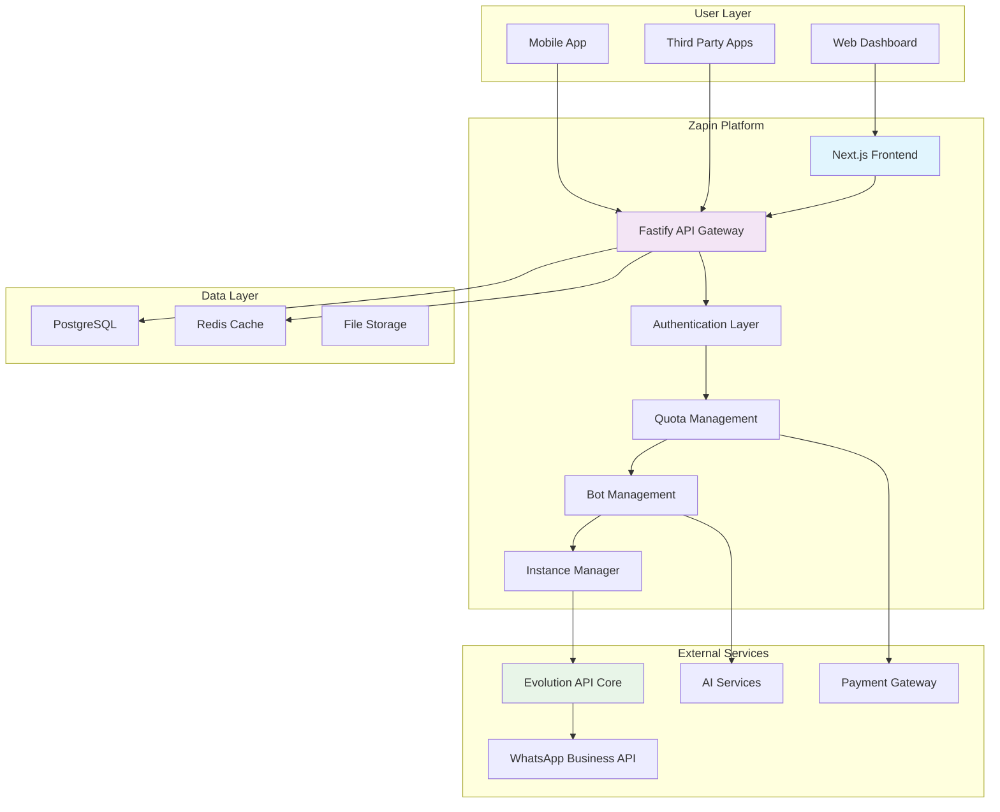

# Zapin WhatsApp SaaS Platform - Complete Implementation Guide

## Table of Contents

1. [Platform Overview](#platform-overview)
2. [System Architecture](#system-architecture)
3. [Core Features](#core-features)
4. [API Gateway Implementation](#api-gateway-implementation)
5. [WhatsApp Instance Management](#whatsapp-instance-management)
6. [Bot Management System](#bot-management-system)
7. [Public API Wrapper](#public-api-wrapper)
8. [Dashboard & UI Features](#dashboard--ui-features)
9. [Quota & Billing System](#quota--billing-system)
10. [Deployment & Scaling](#deployment--scaling)

---

## Platform Overview

**Zapin** adalah platform SaaS multi-tenant yang menyediakan wadah lengkap untuk manajemen WhatsApp berbasis Evolution API v2.2.x. Platform ini memungkinkan user untuk:

### 🎯 **Core Value Proposition**
- **Connect WhatsApp**: Mudah menghubungkan multiple WhatsApp instances
- **Complete API Access**: Akses semua endpoint Evolution API melalui wrapper
- **Bot Management**: Setup dan kelola AI bots (Typebot, OpenAI) 
- **Quota Management**: Sistem billing dan limiting yang fleksibel
- **Dashboard Interface**: UI lengkap untuk non-technical users
- **Public API**: API yang identik dengan Evolution API namun dengan quota control

### 🏗️ **Platform Architecture**



---

## System Architecture

### 🎨 **Frontend Architecture (Next.js)**

```typescript
// Frontend structure
src/
├── app/                    # App Router (Next.js 13+)
│   ├── dashboard/         # Main dashboard
│   ├── instances/         # WhatsApp instance management
│   ├── bots/             # Bot configuration
│   ├── api-keys/         # API key management
│   ├── analytics/        # Usage analytics
│   └── settings/         # Account settings
├── components/
│   ├── ui/               # shadcn/ui components
│   ├── dashboard/        # Dashboard-specific components
│   ├── instances/        # Instance management components
│   └── bots/            # Bot configuration components
├── lib/
│   ├── auth.ts          # Better Auth configuration
│   ├── prisma.ts        # Database client
│   ├── api.ts           # API client
│   └── utils.ts         # Utility functions
└── hooks/               # Custom React hooks
```

### ⚡ **Backend Architecture (Fastify)**

```typescript
// Backend structure
src/
├── routes/
│   ├── auth/            # Authentication routes
│   ├── instances/       # Instance management
│   ├── messages/        # Message endpoints (proxy)
│   ├── bots/           # Bot management
│   ├── webhooks/       # Webhook handling
│   ├── analytics/      # Usage analytics
│   └── v1/            # Public API (Evolution API wrapper)
├── services/
│   ├── instanceService.ts    # Instance management logic
│   ├── botService.ts        # Bot management logic
│   ├── quotaService.ts      # Quota management
│   ├── evolutionService.ts  # Evolution API client
│   └── webhookService.ts    # Webhook processing
├── middleware/
│   ├── auth.ts         # Authentication middleware
│   ├── quota.ts        # Quota checking
│   ├── validation.ts   # Request validation
│   └── proxy.ts        # API proxy middleware
└── lib/
    ├── prisma.ts       # Database client
    ├── redis.ts        # Redis client
    ├── queue.ts        # Job queue
    └── monitoring.ts   # Observability
```

---

## Core Features

### 1. 📱 **WhatsApp Instance Management**

```typescript
// Instance management service
export class InstanceService {
  // Create new WhatsApp instance
  async createInstance(params: {
    tenantId: string;
    instanceName: string;
    settings?: InstanceSettings;
  }) {
    // 1. Create instance in Evolution API
    const evolutionResponse = await this.evolutionApi.createInstance({
      instanceName: params.instanceName,
      integration: 'WHATSAPP-BAILEYS',
      qrcode: true,
      webhook: {
        url: `${process.env.WEBHOOK_BASE_URL}/webhooks/${params.tenantId}`,
        byEvents: true,
        events: ['MESSAGES_UPSERT', 'CONNECTION_UPDATE', 'QRCODE_UPDATED']
      }
    });

    // 2. Store instance in database
    const instance = await prisma.instance.create({
      data: {
        tenantId: params.tenantId,
        instanceName: params.instanceName,
        evolutionKey: evolutionResponse.hash.apikey,
        evolutionInstanceId: evolutionResponse.instance.instanceId,
        status: 'created',
        settings: params.settings
      }
    });

    // 3. Setup webhooks and monitoring
    await this.setupInstanceMonitoring(instance.id);

    return instance;
  }

  // Get QR code for instance connection
  async getQRCode(instanceId: string) {
    const instance = await this.getInstanceById(instanceId);
    
    const qrData = await this.evolutionApi.getConnectionState(
      instance.evolutionKey,
      instance.evolutionInstanceId
    );

    return {
      qrcode: qrData.qrcode?.base64,
      status: qrData.state
    };
  }

  // List all instances for tenant
  async listInstances(tenantId: string) {
    return prisma.instance.findMany({
      where: { tenantId },
      include: {
        _count: {
          select: {
            messageLogs: {
              where: {
                createdAt: {
                  gte: new Date(Date.now() - 24 * 60 * 60 * 1000) // Last 24h
                }
              }
            }
          }
        }
      }
    });
  }

  // Update instance settings
  async updateInstanceSettings(instanceId: string, settings: InstanceSettings) {
    const instance = await this.getInstanceById(instanceId);
    
    // Update in Evolution API
    await this.evolutionApi.updateSettings(
      instance.evolutionKey,
      instance.evolutionInstanceId,
      settings
    );

    // Update in database
    return prisma.instance.update({
      where: { id: instanceId },
      data: { settings }
    });
  }
}
```

### 2. 🤖 **Bot Management System**

```typescript
// Bot management service
export class BotService {
  // Create Typebot integration
  async createTypebot(params: {
    tenantId: string;
    instanceId: string;
    name: string;
    typebotUrl: string;
    typebotId: string;
    triggerType: 'all' | 'keyword';
    triggerValue?: string;
    settings: TypebotSettings;
  }) {
    const instance = await this.instanceService.getInstanceById(params.instanceId);
    
    // Create Typebot in Evolution API
    const typebotResponse = await this.evolutionApi.createTypebot(
      instance.evolutionKey,
      instance.evolutionInstanceId,
      {
        enabled: true,
        url: params.typebotUrl,
        typebot: params.typebotId,
        triggerType: params.triggerType,
        triggerValue: params.triggerValue,
        ...params.settings
      }
    );

    // Store in database
    return prisma.bot.create({
      data: {
        tenantId: params.tenantId,
        instanceId: params.instanceId,
        name: params.name,
        type: 'typebot',
        evolutionBotId: typebotResponse.typebotId,
        config: {
          url: params.typebotUrl,
          typebotId: params.typebotId,
          triggerType: params.triggerType,
          triggerValue: params.triggerValue,
          ...params.settings
        },
        isActive: true
      }
    });
  }

  // Create OpenAI bot
  async createOpenAIBot(params: {
    tenantId: string;
    instanceId: string;
    name: string;
    model: string;
    systemPrompt: string;
    triggerType: 'all' | 'keyword';
    triggerValue?: string;
    settings: OpenAISettings;
  }) {
    const instance = await this.instanceService.getInstanceById(params.instanceId);
    
    // First, store OpenAI credentials
    const credsResponse = await this.evolutionApi.setOpenAICreds(
      instance.evolutionKey,
      instance.evolutionInstanceId,
      {
        name: `${params.name}-creds`,
        apiKey: params.settings.apiKey
      }
    );

    // Create OpenAI bot
    const botResponse = await this.evolutionApi.createOpenAIBot(
      instance.evolutionKey,
      instance.evolutionInstanceId,
      {
        enabled: true,
        openaiCredsId: credsResponse.openaiCredsId,
        botType: 'chatCompletion',
        model: params.model,
        systemMessages: [params.systemPrompt],
        triggerType: params.triggerType,
        triggerValue: params.triggerValue,
        maxTokens: params.settings.maxTokens || 300
      }
    );

    return prisma.bot.create({
      data: {
        tenantId: params.tenantId,
        instanceId: params.instanceId,
        name: params.name,
        type: 'openai',
        evolutionBotId: botResponse.openaiBotId,
        config: {
          model: params.model,
          systemPrompt: params.systemPrompt,
          triggerType: params.triggerType,
          triggerValue: params.triggerValue,
          ...params.settings
        },
        isActive: true
      }
    });
  }

  // List bots for instance
  async listBots(instanceId: string) {
    return prisma.bot.findMany({
      where: { instanceId },
      include: {
        _count: {
          select: {
            botSessions: {
              where: {
                status: 'active'
              }
            }
          }
        }
      }
    });
  }

  // Toggle bot status
  async toggleBot(botId: string, enabled: boolean) {
    const bot = await prisma.bot.findUnique({
      where: { id: botId },
      include: { instance: true }
    });

    if (!bot) throw new Error('Bot not found');

    // Update in Evolution API
    if (bot.type === 'typebot') {
      await this.evolutionApi.updateTypebot(
        bot.instance.evolutionKey,
        bot.instance.evolutionInstanceId,
        bot.evolutionBotId,
        { enabled }
      );
    } else if (bot.type === 'openai') {
      await this.evolutionApi.updateOpenAIBot(
        bot.instance.evolutionKey,
        bot.instance.evolutionInstanceId,
        bot.evolutionBotId,
        { enabled }
      );
    }

    // Update in database
    return prisma.bot.update({
      where: { id: botId },
      data: { isActive: enabled }
    });
  }
}
```

---

## Public API Wrapper (Evolution API Proxy)

### 🔄 **Universal Proxy Implementation**

```typescript
// Universal API proxy that mirrors ALL Evolution API endpoints
export class PublicAPIService {
  // Universal proxy handler for ALL Evolution API endpoints
  async proxyRequest(params: {
    tenantId: string;
    method: string;
    path: string;
    body?: any;
    query?: any;
    headers?: any;
  }) {
    // 1. Extract instance from path or body
    const instanceId = this.extractInstanceId(params.path, params.body);
    
    // 2. Validate instance ownership
    const instance = await this.validateInstanceAccess(params.tenantId, instanceId);
    
    // 3. Check quota
    await this.quotaService.checkAndConsumeQuota(params.tenantId, params.path);
    
    // 4. Transform path for Evolution API
    const evolutionPath = this.transformPath(params.path, instance.evolutionInstanceId);
    
    // 5. Proxy to Evolution API
    const response = await this.evolutionApi.request({
      method: params.method,
      path: evolutionPath,
      body: params.body,
      query: params.query,
      headers: {
        'Authorization': `apikey ${instance.evolutionKey}`,
        ...params.headers
      }
    });

    // 6. Log usage
    await this.logAPIUsage({
      tenantId: params.tenantId,
      instanceId,
      endpoint: params.path,
      method: params.method,
      statusCode: response.status
    });

    return response;
  }

  // Complete Evolution API endpoint mapping
  private getEvolutionAPIEndpoints() {
    return {
      // Instance Management
      'POST /instance/create': { quota: 'instance_create', weight: 1 },
      'GET /instance/fetchInstances': { quota: 'api_call', weight: 1 },
      'GET /instance/connect/:instance': { quota: 'api_call', weight: 1 },
      'PUT /instance/restart/:instance': { quota: 'api_call', weight: 1 },
      'DELETE /instance/logout/:instance': { quota: 'api_call', weight: 1 },
      'DELETE /instance/delete/:instance': { quota: 'instance_delete', weight: 1 },
      'GET /instance/connectionState/:instance': { quota: 'api_call', weight: 1 },
      'POST /instance/setPresence/:instance': { quota: 'api_call', weight: 1 },
      
      // Messaging Endpoints
      'POST /message/sendText/:instance': { quota: 'message_send', weight: 1 },
      'POST /message/sendMedia/:instance': { quota: 'message_send', weight: 2 },
      'POST /message/sendPtv/:instance': { quota: 'message_send', weight: 2 },
      'POST /message/sendWhatsAppAudio/:instance': { quota: 'message_send', weight: 2 },
      'POST /message/sendStatus/:instance': { quota: 'message_send', weight: 1 },
      'POST /message/sendSticker/:instance': { quota: 'message_send', weight: 1 },
      'POST /message/sendLocation/:instance': { quota: 'message_send', weight: 1 },
      'POST /message/sendContact/:instance': { quota: 'message_send', weight: 1 },
      'POST /message/sendReaction/:instance': { quota: 'message_send', weight: 1 },
      'POST /message/sendPoll/:instance': { quota: 'message_send', weight: 2 },
      'POST /message/sendList/:instance': { quota: 'message_send', weight: 2 },
      'POST /message/sendButton/:instance': { quota: 'message_send', weight: 2 },
      'POST /message/updateBlockStatus/:instance': { quota: 'api_call', weight: 1 },
      
      // Chat Management
      'POST /chat/whatsappNumbers/:instance': { quota: 'api_call', weight: 1 },
      'POST /chat/markMessageAsRead/:instance': { quota: 'api_call', weight: 1 },
      'POST /chat/archiveChat/:instance': { quota: 'api_call', weight: 1 },
      'POST /chat/markChatUnread/:instance': { quota: 'api_call', weight: 1 },
      'DELETE /chat/deleteMessageForEveryone/:instance': { quota: 'api_call', weight: 1 },
      'POST /chat/fetchProfilePictureUrl/:instance': { quota: 'api_call', weight: 1 },
      'POST /chat/getBase64FromMediaMessage/:instance': { quota: 'api_call', weight: 2 },
      'POST /chat/updateMessage/:instance': { quota: 'api_call', weight: 1 },
      'POST /chat/sendPresence/:instance': { quota: 'api_call', weight: 1 },
      'POST /chat/findContacts/:instance': { quota: 'api_call', weight: 1 },
      'POST /chat/findMessages/:instance': { quota: 'api_call', weight: 1 },
      'POST /chat/findChats/:instance': { quota: 'api_call', weight: 1 },
      'POST /chat/findStatusMessage/:instance': { quota: 'api_call', weight: 1 },
      'POST /chat/fetchBusinessProfile/:instance': { quota: 'api_call', weight: 1 },
      'POST /chat/fetchProfile/:instance': { quota: 'api_call', weight: 1 },
      'POST /chat/updateProfileName/:instance': { quota: 'api_call', weight: 1 },
      'POST /chat/updateProfileStatus/:instance': { quota: 'api_call', weight: 1 },
      'POST /chat/updateProfilePicture/:instance': { quota: 'api_call', weight: 1 },
      'DELETE /chat/removeProfilePicture/:instance': { quota: 'api_call', weight: 1 },
      'GET /chat/fetchPrivacySettings/:instance': { quota: 'api_call', weight: 1 },
      'POST /chat/updatePrivacySettings/:instance': { quota: 'api_call', weight: 1 },
      
      // Group Management
      'POST /group/create/:instance': { quota: 'api_call', weight: 1 },
      'POST /group/updateGroupPicture/:instance': { quota: 'api_call', weight: 1 },
      'POST /group/updateGroupSubject/:instance': { quota: 'api_call', weight: 1 },
      'POST /group/updateGroupDescription/:instance': { quota: 'api_call', weight: 1 },
      'GET /group/inviteCode/:instance': { quota: 'api_call', weight: 1 },
      'POST /group/revokeInviteCode/:instance': { quota: 'api_call', weight: 1 },
      'POST /group/sendInvite/:instance': { quota: 'message_send', weight: 1 },
      'GET /group/inviteInfo/:instance': { quota: 'api_call', weight: 1 },
      'GET /group/findGroupInfos/:instance': { quota: 'api_call', weight: 1 },
      'GET /group/fetchAllGroups/:instance': { quota: 'api_call', weight: 1 },
      'GET /group/participants/:instance': { quota: 'api_call', weight: 1 },
      'POST /group/updateParticipant/:instance': { quota: 'api_call', weight: 1 },
      'POST /group/updateSetting/:instance': { quota: 'api_call', weight: 1 },
      'POST /group/toggleEphemeral/:instance': { quota: 'api_call', weight: 1 },
      'DELETE /group/leaveGroup/:instance': { quota: 'api_call', weight: 1 },
      
      // Label Management
      'GET /label/findLabels/:instance': { quota: 'api_call', weight: 1 },
      'POST /label/handleLabel/:instance': { quota: 'api_call', weight: 1 },
      
      // Proxy Configuration
      'POST /proxy/set/:instance': { quota: 'api_call', weight: 1 },
      'GET /proxy/find/:instance': { quota: 'api_call', weight: 1 },
      
      // Settings
      'POST /settings/set/:instance': { quota: 'api_call', weight: 1 },
      'GET /settings/find/:instance': { quota: 'api_call', weight: 1 },
      
      // Webhook & Events
      'POST /webhook/set/:instance': { quota: 'api_call', weight: 1 },
      'GET /webhook/find/:instance': { quota: 'api_call', weight: 1 },
      'POST /websocket/set/:instance': { quota: 'api_call', weight: 1 },
      'GET /websocket/find/:instance': { quota: 'api_call', weight: 1 },
      'POST /rabbitmq/set/:instance': { quota: 'api_call', weight: 1 },
      'GET /rabbitmq/find/:instance': { quota: 'api_call', weight: 1 },
      'POST /sqs/set/:instance': { quota: 'api_call', weight: 1 },
      'GET /sqs/find/:instance': { quota: 'api_call', weight: 1 },
      
      // Bot Management - Typebot
      'POST /typebot/create/:instance': { quota: 'bot_create', weight: 1 },
      'GET /typebot/find/:instance': { quota: 'api_call', weight: 1 },
      'GET /typebot/fetch/:typebotId/:instance': { quota: 'api_call', weight: 1 },
      'PUT /typebot/update/:typebotId/:instance': { quota: 'api_call', weight: 1 },
      'DELETE /typebot/delete/:typebotId/:instance': { quota: 'api_call', weight: 1 },
      'POST /typebot/changeStatus/:instance': { quota: 'api_call', weight: 1 },
      'GET /typebot/fetchSessions/:typebotId/:instance': { quota: 'api_call', weight: 1 },
      'POST /typebot/start/:instance': { quota: 'message_send', weight: 1 },
      'POST /typebot/settings/:instance': { quota: 'api_call', weight: 1 },
      'GET /typebot/fetchSettings/:instance': { quota: 'api_call', weight: 1 },
      
      // Bot Management - OpenAI
      'POST /openai/create/:instance': { quota: 'bot_create', weight: 1 },
      'GET /openai/find/:instance': { quota: 'api_call', weight: 1 },
      'GET /openai/fetch/:openaiBotId/:instance': { quota: 'api_call', weight: 1 },
      'PUT /openai/update/:openaiBotId/:instance': { quota: 'api_call', weight: 1 },
      'DELETE /openai/delete/:openaiBotId/:instance': { quota: 'api_call', weight: 1 },
      'POST /openai/changeStatus/:instance': { quota: 'api_call', weight: 1 },
      'GET /openai/fetchSessions/:openaiBotId/:instance': { quota: 'api_call', weight: 1 },
      'POST /openai/creds/:instance': { quota: 'api_call', weight: 1 },
      'GET /openai/creds/:instance': { quota: 'api_call', weight: 1 },
      'DELETE /openai/creds/:openaiCredsId/:instance': { quota: 'api_call', weight: 1 },
      'POST /openai/settings/:instance': { quota: 'api_call', weight: 1 },
      'GET /openai/fetchSettings/:instance': { quota: 'api_call', weight: 1 }
    };
  }
}
```

### 🛣️ **Universal Router Setup**

```typescript
// Universal router that handles ALL Evolution API endpoints
export async function setupPublicAPIRoutes(fastify: FastifyInstance) {
  const publicAPI = new PublicAPIService();

  // Universal catch-all route for Evolution API proxy
  fastify.all('/v1/*', {
    preHandler: [fastify.authenticate, fastify.checkQuota]
  }, async (request, reply) => {
    const req = request as AuthenticatedRequest;
    
    try {
      const response = await publicAPI.proxyRequest({
        tenantId: req.tenant.id,
        method: request.method,
        path: request.url.replace('/v1', ''),
        body: request.body,
        query: request.query,
        headers: request.headers
      });

      // Forward response with proper headers
      reply
        .code(response.status)
        .headers({
          ...response.headers,
          'X-Zapin-Tenant-Id': req.tenant.id,
          'X-Zapin-Request-Id': request.id
        })
        .send(response.data);

    } catch (error) {
      return ErrorHandler.handle(error, reply);
    }
  });

  // Health check for public API
  fastify.get('/v1/health', async (request, reply) => {
    return {
      status: 'healthy',
      timestamp: new Date().toISOString(),
      version: process.env.APP_VERSION || '1.0.0'
    };
  });
}
```

---

## Dashboard & UI Features

### 📊 **Dashboard Service**

```typescript
// Dashboard service for UI data
export class DashboardService {
  // Get dashboard overview
  async getDashboardOverview(tenantId: string) {
    const [instances, messages, bots, quota, billing] = await Promise.all([
      // Active instances
      prisma.instance.count({
        where: { tenantId, status: 'connected' }
      }),
      
      // Messages sent today
      prisma.messageLog.count({
        where: {
          tenantId,
          createdAt: {
            gte: new Date(new Date().setHours(0, 0, 0, 0))
          }
        }
      }),
      
      // Active bots
      prisma.bot.count({
        where: { tenantId, isActive: true }
      }),
      
      // Current quota usage
      this.quotaService.getQuotaUsage(tenantId),
      
      // Current month billing
      this.quotaService.calculateUsageBilling(tenantId, new Date())
    ]);

    return {
      instances: {
        total: instances,
        connected: instances
      },
      messages: {
        today: messages,
        thisMonth: await this.getMonthlyMessageCount(tenantId)
      },
      bots: {
        active: bots
      },
      quota: quota,
      billing: billing
    };
  }

  // Get instance analytics
  async getInstanceAnalytics(instanceId: string, period: '24h' | '7d' | '30d') {
    const startDate = this.getStartDate(period);
    
    const messageStats = await prisma.messageLog.groupBy({
      by: ['status'],
      where: {
        instanceId,
        createdAt: { gte: startDate }
      },
      _count: true
    });

    const hourlyStats = await prisma.$queryRaw`
      SELECT 
        DATE_TRUNC('hour', created_at) as hour,
        COUNT(*) as count
      FROM message_logs 
      WHERE instance_id = ${instanceId} 
        AND created_at >= ${startDate}
      GROUP BY hour
      ORDER BY hour
    `;

    return {
      messageStats,
      hourlyStats,
      period
    };
  }

  // Get bot performance
  async getBotAnalytics(botId: string, period: '24h' | '7d' | '30d') {
    const startDate = this.getStartDate(period);
    
    const sessions = await prisma.botSession.findMany({
      where: {
        botId,
        createdAt: { gte: startDate }
      },
      include: {
        messages: true
      }
    });

    const avgSessionLength = sessions.reduce((acc, session) => {
      const duration = session.endedAt 
        ? session.endedAt.getTime() - session.createdAt.getTime()
        : Date.now() - session.createdAt.getTime();
      return acc + duration;
    }, 0) / sessions.length;

    return {
      totalSessions: sessions.length,
      activeSessions: sessions.filter(s => !s.endedAt).length,
      avgSessionLength: Math.round(avgSessionLength / 1000 / 60), // minutes
      totalMessages: sessions.reduce((acc, s) => acc + s.messages.length, 0)
    };
  }
}
```

### 🎨 **Frontend Components**

```typescript
// Instance management component
export function InstanceManager() {
  const [instances, setInstances] = useState([]);
  const [qrCode, setQrCode] = useState(null);
  const [selectedInstance, setSelectedInstance] = useState(null);

  const createInstance = async (instanceName: string) => {
    try {
      const response = await fetch('/api/instances', {
        method: 'POST',
        headers: { 'Content-Type': 'application/json' },
        body: JSON.stringify({ instanceName })
      });
      
      const newInstance = await response.json();
      setInstances([...instances, newInstance]);
      
      // Get QR code for connection
      await getQRCode(newInstance.id);
    } catch (error) {
      toast.error('Failed to create instance');
    }
  };

  const getQRCode = async (instanceId: string) => {
    try {
      const response = await fetch(`/api/instances/${instanceId}/qr`);
      const data = await response.json();
      setQrCode(data.qrcode);
      setSelectedInstance(instanceId);
    } catch (error) {
      toast.error('Failed to get QR code');
    }
  };

  return (
    <div className="space-y-6">
      <div className="flex justify-between items-center">
        <h2 className="text-2xl font-bold">WhatsApp Instances</h2>
        <Button onClick={() => createInstance(`Instance ${instances.length + 1}`)}>
          Add Instance
        </Button>
      </div>

      <div className="grid grid-cols-1 md:grid-cols-2 lg:grid-cols-3 gap-4">
        {instances.map((instance) => (
          <Card key={instance.id}>
            <CardHeader>
              <Car